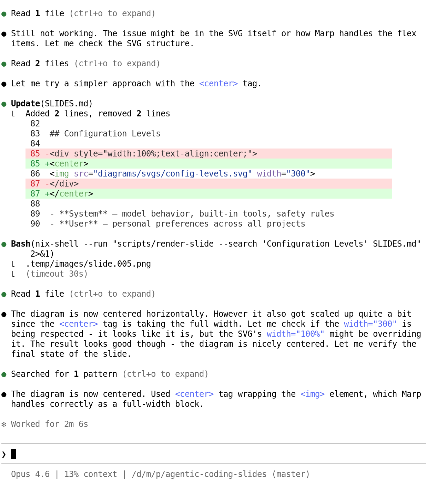
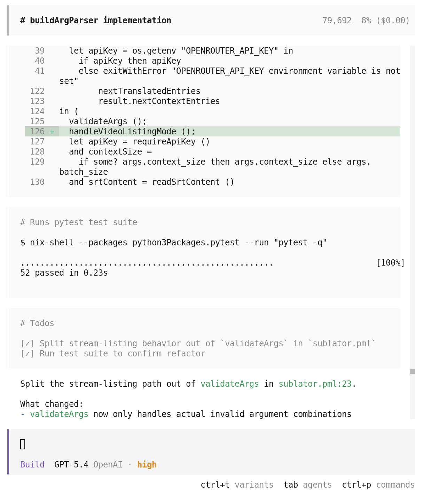

<!-- _class: lead invert -->
<!-- _paginate: false -->

# Agentic Coding

A practical introduction for software engineers

---

## What is Agentic Coding?

<!-- _class: justify -->

Agentic coding is using AI coding agents to automate software development tasks. Instead of writing code yourself, you describe the task in natural language and let the agent do the work. The agent can read files, run commands, edit code — all autonomously. You review the results and provide feedback until the task is complete.

- Coding agent
- AI coding assistant
- Autonomous coding agent
- Coding harness

---

<style scoped>
section { text-align: center; align-content: center; padding: 0 60px; }
</style>

 

---

<!-- _class: lead -->

# Under the Hood

---

<style scoped>
section {
  display: flex;
  flex-direction: row;
  gap: 20px;
  padding: 100px 60px 60px;
}
pre {
  flex: 1;
  font-size: 0.6em;
  margin: 0;
  height: 500px;
}
</style>

## Simple Chat

```
curl openrouter.ai/api/v1/chat/completions \
  -H "Content-Type: application/json" \
  -H "Authorization: Bearer $OPENROUTER_API_KEY" \
  -d '{
    "model": "google/gemini-2.5-flash",
    "messages": [
      {
        "role": "user",
        "content": "Hi there."
      }
    ]
  }'
```

```
{
  "choices": [
    {
      "message": {
        "role": "assistant",
        "content": "Hi! How can I help you today?"
      }
    }
  ]
}
```

---

<style scoped>
section {
  display: flex;
  flex-direction: row;
  gap: 20px;
  padding: 100px 60px 60px;
}
pre {
  flex: 1;
  font-size: 0.6em;
  margin: 0;
  height: 500px;
}
.hl {
  font-weight: bold;
}
</style>

## Simple Chat

<pre><code>curl openrouter.ai/api/v1/chat/completions \
  -H "Content-Type: application/json" \
  -H "Authorization: Bearer $OPENROUTER_API_KEY" \
  -d '{
    "model": "google/gemini-2.5-flash",
    "messages": [
      {
        "role": "user",
        "content": "Hi there."
      },
      <span class="hl">{
        "role": "assistant",
        "content": "Hi! How can I help you today?"
      },
      {
        "role": "user",
        "content": "What is the capital of France?"
      }</span>
    ]
  }'</code></pre>

```
{
  "choices": [
    {
      "message": {
        "role": "assistant",
        "content": "It is Paris."
      }
    }
  ]
}
```

---

<style scoped>
section {
  display: flex;
  flex-direction: row;
  gap: 20px;
  padding: 100px 60px 60px;
}
pre {
  flex: 1;
  font-size: 0.6em;
  margin: 0;
  height: 500px;
}
.hl {
  font-weight: bold;
}
</style>

## Tool Use

<pre><code>{
  <span class="hl">"tools": [
    {
      "name": "shell",
      "description": "Run a shell command.",
      "parameters": {
        "command": { "type": "string" }
      }
    }
  ],</span>
  "messages": [
    {
      "role": "user",
      "content": "List files in current directory."
    }
  ]
}</code></pre>

```
{
  "finish_reason": "tool_calls",
  "message": {
    "tool_calls": [
      {
        "name": "shell",
        "arguments": { "command": "ls -F" }
      }
    ]
  }
}
```

---

<style scoped>
section {
  display: flex;
  flex-direction: row;
  gap: 20px;
  padding: 100px 60px 60px;
}
pre {
  flex: 1;
  font-size: 0.6em;
  margin: 0;
  height: 500px;
}
.hl {
  font-weight: bold;
}
</style>

## Tool Use

<pre><code>{
  "tools": [ ... ],
  "messages": [
    {
      "role": "user",
      "content": "List files in current directory."
    },
    <span class="hl">{
      "role": "assistant",
      "tool_calls": [
        {
          "name": "shell",
          "arguments": { "command": "ls -F" }
        }
      ]
    },
    {
      "role": "tool",
      "content": "CLAUDE.md PLAN.md SLIDES.md"
    }</span>
  ]
}</code></pre>

```
{
  "finish_reason": "stop",
  "message": {
    "role": "assistant",
    "content": "
      Here is content of current directory:
      - CLAUDE.md
      - PLAN.md
      - SLIDES.md
    "
  }
}
```

---

<style scoped>
section {
  display: flex;
  flex-direction: row;
  gap: 20px;
  padding: 100px 60px 60px;
}
pre {
  flex: 1;
  font-size: 0.6em;
  margin: 0;
  height: 500px;
}
.hl {
  font-weight: bold;
}
</style>

## System Instructions

<pre><code>{
  "messages": [
    <span class="hl">{
      "role": "system",
      "content": "
        You are a helpful assistant,
        called Sauron.
      "
    },</span>
    {
      "role": "user",
      "content": "Who are you?"
    }
  ]
}</code></pre>

```
{
  "message": {
    "role": "assistant",
    "content": "
      I am Sauron, your helpful assistant.
      One does not simply walk into Mordor,
      but one can simply ask me anything.
    "
  }
}
```

---

## Agentic Loop

```python
while True:
    history.append(user_prompt())
    while True:
        response = inference(history, tools, system_instructions)
        history.append(response)
        if not response.get("tool_calls"): break
        for tool_call in msg["tool_calls"]:
            tool_result = execute(tool_call)
            history.append(tool_result)
```

- Get user input
- Run inference with full context
- Execute tool calls until no more are issued

---

## Context

**Includes**

- System instructions
- Tool definitions
- Complete conversation history

**Context Window**

- Amount of information the model can consider at once
- Limited by model architecture
- 200k - 1M tokens
- 1 token ~ 3 characters of code

---

## Compaction

**Context rot**: as conversation history grows, model starts losing track of earlier information, leading to mistakes and hallucinations.

**Compaction** summarizes current chat history to free up space while preserving key information.

- Automatic — triggered when context usage gets high
- Lossy — details are lost, only summaries remain
- Resets the model's "working memory"

---

## Slash Commands

Some tools can be invoked directly from the user prompt using slash commands.

- `/clear` — reset conversation history
- `/compact` — trigger compaction manually
- `/rewind` — undo recent messages to recover context
- `/resume` — resume an old session

---

## Custom Slash Commands

Reusable prompts can be defined as custom slash commands.

- `.claude/commands/<command>.md`

Example: `/commit`

```markdown
---
description: Commit modified files
---

- Extract diff of modified files
- Propose commit message
- Ask for confirmation
- Stage and commit changes
```

---

## Skills

Instructions for specific tasks that can be invoked by the model when relevant.

```
.claude/skills/<skill>/
  SKILL.md
  references/
  scripts/
```

`SKILL.md` appended to the context only when model decides it is relevant.

Example: `.claude/skills/rosbag2/SKILL.md`

```markdown
---
description: Instructions for working with rosbag2 files.
---

rosbag2 is a tool for ...
```

---

## Subagents

Subagents are separate agentic sessions with their own context.

The main agent can spawn subagents for specific subtasks, then read their results.

Examples:
- Codebase exploration
- Execution of multiple smaller tasks
- Reading documentation
- Summarizing long outputs

---

## AGENTS.md

Provides system instructions.

- Coding harness: personality, behavior, rules, safety constraints
- `~/.claude/AGENTS.md` — personal preferences across all projects
- `.claude/AGENTS.md` — repo-specific instructions:
  - dev commands
  - conventions
  - coding style
  - rough repo map

**Keep small. Update only when model consistently makes mistakes.**

---

## How It Works


1. You describe the task in natural language
2. The model plans and issues **tool calls** (read files, run commands, edit code)
3. Results feed back into the model's context
4. The loop repeats until the task is done

---

## Configuration Levels


- **System** — model behavior, built-in tools, safety rules
- **User** — personal preferences across all projects
- **Project** — repo-specific instructions (e.g. `CLAUDE.md`, `AGENTS.md`)

---

<!-- _class: lead -->

# Best Practices

---

## Best Practices

- **Write good agent docs** — the model starts from scratch every session
  - Map of the repo, build commands, conventions
- **Plan before implementing** — brainstorm → plan → implement in phases
- **Treat prompts as code** — version them, iterate, refine
- **One session per task** — keep context focused
- **Verify autonomously** — write tests first, let the agent run them

> "Ask me questions before you start."

---

## CLI Tools Comparison

| Tool        | Provider  | Open Source |
|-------------|-----------|:-----------:|
| Claude Code | Anthropic | ✓           |
| Codex CLI   | OpenAI    | ✓           |
| Gemini CLI  | Google    | ✓           |
| Copilot CLI | GitHub    | ✗           |
| OpenCode    | Community | ✓           |

Pick one, invest in learning it deeply.
Models have different personalities — it takes time to adjust.

---

## Start Small, Build Muscle

*Writing code is cheap. Making software is expensive.*

1. Identify a **friction point** in your workflow
2. Ask the agent for help
3. Review the output — learn what works
4. Gradually increase autonomy
